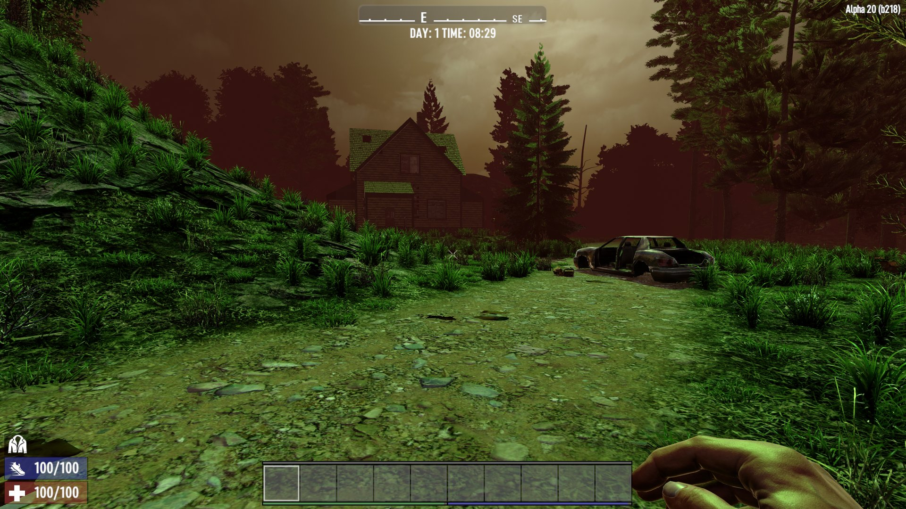

# POC for new weather spectrums in 7D2D (A20)

Proof of concept on how to add new weather spectrums to A20.
Not all edges are polished and there is some challenge to make
this more plugable if more than one mod wants to modify this.

Weather is also not hooked up to any Biome, the only way to
see the effect is by using the console `spectrum NewWeather`.
If it succeeds, the sun-light should be a bright green :)

Added generic harmony hook to let the new weather spectrum
be hooked up to biome weather via xml config.
Made snow biome green and hostile ;)

### Download and Install

Simply download here from GitHub and put into your A20 Mods folder:

- https://github.com/OCB7D2D/POC-NewWeather/archive/master.zip

## Compatibility

I've developed and tested this Mod against version a20.b218.
